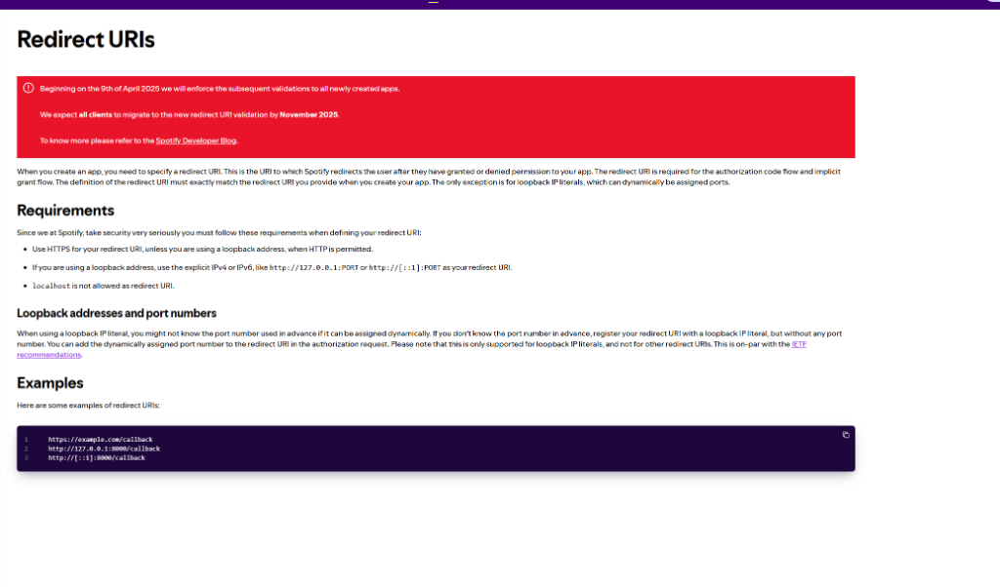
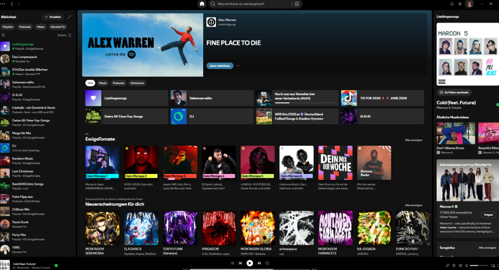
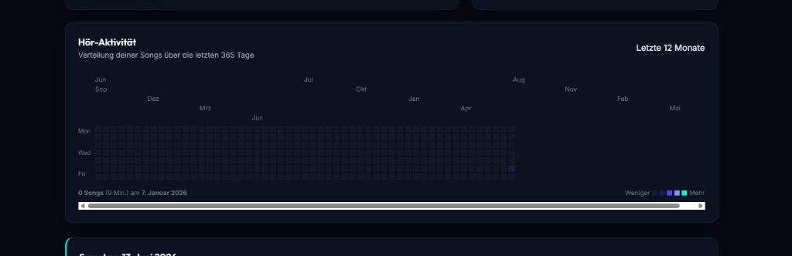
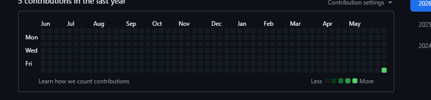
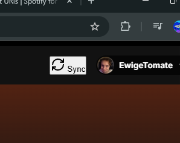

# Spotify Listening Tracker & Analytics

A self-hosted, multi-user web application to track, analyze, and visualize your Spotify listening habits. Features detailed telemetry logging (volume, devices), Gemini 1.5 Flash AI-powered reports, and a full-screen interactive **Spotify Wrapped** story slideshow!

---

## 📸 Screenshots

Here is a preview of the interface and features:

### 1. Main Dashboard & Activity Grid
Displays quick statistics (total hours, plays, daily averages), recently played items, and a GitHub-style listening calendar.


### 2. Full-Screen Spotify Wrapped
An interactive slides presentation recapping your musical year with animated progress bars, top songs/artists, and your AI Music Personality.


### 3. Gemini AI Reports & Insights
Generate detailed summaries and humorous personality analysis of your music taste with Gemini 1.5 Flash.


### 4. Listening Habits & Peak Hours
Analyze your listening habits based on 24-hour quadrants (Night, Morning, Afternoon, Evening).


### 5. Persistent Telemetry Player
Tracks currently playing tracks and podcasts, showing active volume, device name, and progress timers.


---

## 🚀 Key Features

*   **Multi-User Portal**: Sleek "Wer hört gerade?" profile selection screen and top-bar account switcher. Multiple users can concurrently connect accounts.
*   **Active Telemetry Logging**: Background poller records volume, device names, device types, and playback progress every 30 seconds.
*   **Podcast & Video-Podcast Support**: Correctly matches episode details and artwork using custom Spotify Web API fallbacks.
*   **GitHub-Style Activity Calendar**: Interactive 365-day grid visualizing historical playback volume with tooltips and day-by-day track listings.
*   **Google Gemini 1.5 Flash Integration**: Analyzes metrics to formulate witzige insights, headlines, and a custom music character description.
*   **Immersive Story Mode (Wrapped)**: Swipeable or tap-controlled slideshow with auto-advancing progress indicators recapping stats and sharing cards.

---

## 🛠️ Installation & Setup

### 1. Spotify App Configuration
1.  Go to the [Spotify Developer Dashboard](https://developer.spotify.com/dashboard) and log in.
2.  Click **Create App** and name your application.
3.  Edit settings and add the following **Redirect URI**:
    ```text
    http://127.0.0.1:3000/api/auth/callback
    ```
4.  Copy the **Client ID** and **Client Secret**.

### 2. Running Locally
1.  Clone this repository to your local machine.
2.  Install dependencies:
    ```bash
    npm install
    ```
3.  Start the tracker server:
    ```bash
    npm start
    ```
4.  Open `http://localhost:3000` in your web browser.
5.  Go to **Setup & API**, enter your Client ID/Secret, and save.
6.  Connect your Spotify account!

### 3. Enable AI Analytics
1.  Go to **AI-Analysen** in the library menu.
2.  Insert your free API Key from [Google AI Studio](https://aistudio.google.com/).
3.  Click **Täglichen Bericht generieren** or **Wrapped-Bericht generieren** to let Gemini analyze your listening telemetry.
